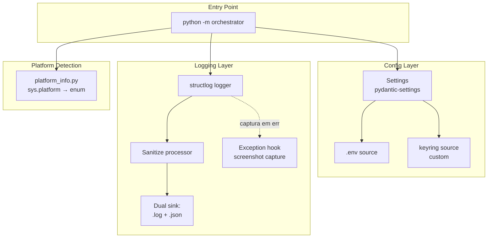

# M0 — Fundação Cross-Platform Design

**Spec**: `.specs/features/m0-foundation/spec.md`
**Status**: Draft

---

## Architecture Overview

A fundação é uma camada horizontal: três módulos independentes (`config`, `logger`, e a estrutura do `orchestrator`) sobre os quais M1–M5 vão construir. Não há fluxo de runtime complexo aqui — o ponto é provar que tudo instala/importa/executa em mac e win, e que segredos + logs respeitam os invariantes do PRD.



**Princípios de design:**

1. **Single source of truth** para config: tudo via `Settings` (Pydantic). Nada de `os.environ.get(...)` espalhado.
2. **Logger central**: módulos pedem logger via `get_logger(__name__)`, nunca instanciam `logging.getLogger` direto.
3. **Plataforma como dado, não como condicional**: `PlatformInfo` é consultado uma vez no boot; resto do código usa o enum.
4. **Falha cedo, falha alto**: setup, segredos faltando, wheel inexistente — tudo erro no boot, não em runtime.

---

## Code Reuse Analysis

### Existing Components to Leverage

Projeto greenfield — não há código próprio para reutilizar. Toda a base vem de bibliotecas externas maduras:

| Componente | Origem | Como Usar |
|---|---|---|
| `pydantic-settings.BaseSettings` | lib | Classe base de `Settings`; carrega de env automaticamente |
| `pydantic-settings.PydanticBaseSettingsSource` | lib | Subclassar para criar `KeyringSettingsSource` |
| `keyring.get_password(service, key)` | lib | Backend nativo do SO (Keychain/Credential Manager) |
| `structlog.processors` | lib | Cadeia: timestamp → sanitize → renderer (humano ou JSON) |
| `python-json-logger` ou `structlog.processors.JSONRenderer` | lib | Saída JSON estruturada |
| `pyautogui.screenshot()` | lib | Captura cross-platform para screenshots de erro |
| `invoke.task` | lib | Decorator para tarefas em `tasks.py` |

### Integration Points

| Sistema | Método de Integração |
|---|---|
| Keychain (macOS) / Credential Manager (Windows) | `keyring` abstrai os dois; service name = `consigaz-robo` |
| `.env` na raiz | `pydantic-settings` carrega automaticamente; precedência menor que keyring |
| `sys.platform` | Lido uma vez em `platform_info.py`; mapeado para `Platform.DARWIN` / `Platform.WIN32` |
| Sistema de arquivos | `pathlib.Path` em todo lugar; nada de strings de path; cria `logs/` e `logs/errors/` no boot |

---

## Components

### `orchestrator`

- **Purpose**: Pacote ponto-de-entrada. Em M0 só implementa `--help` e validação de boot; M4 adiciona despacho de rotinas.
- **Location**: `src/orchestrator/`
  - `__main__.py` — `python -m orchestrator` entry
  - `cli.py` — argparse + comando `--help`
  - `boot.py` — sequência: detecta plataforma → carrega settings → inicializa logger → valida deps mínimas
- **Interfaces**:
  - `main(argv: list[str]) -> int` — entry point, retorna exit code
  - `boot() -> BootContext` — executa boot completo; lança em falha
- **Dependencies**: `config`, `logger`, `platform_info`
- **Reuses**: argparse (stdlib)

### `config`

- **Purpose**: Carregamento e validação de configuração + segredos, com precedência keyring → .env → default.
- **Location**: `src/config/`
  - `settings.py` — `Settings(BaseSettings)`
  - `keyring_source.py` — `KeyringSettingsSource(PydanticBaseSettingsSource)`
  - `display.py` — `show()` utilitário que mascara segredos
- **Interfaces**:
  - `Settings()` — instância carrega tudo no construtor
  - `Settings.openai_api_key: SecretStr`
  - `Settings.log_level: str = "INFO"`
  - `Settings.profile: Literal["dev", "prod"] = "dev"`
  - `show(settings: Settings) -> str` — string com segredos mascarados (`sk-***`)
- **Dependencies**: `pydantic`, `pydantic-settings`, `keyring`
- **Reuses**: Toda a lib `pydantic-settings`

**Precedência** (decisão registrada): `keyring` > `.env` > `default`. Implementada via ordem no override de `settings_customise_sources`:

```python
@classmethod
def settings_customise_sources(cls, ...):
    return (
        init_settings,
        KeyringSettingsSource(settings_cls),  # mais alta após init
        dotenv_settings,
        env_settings,
        file_secret_settings,
    )
```

### `logger`

- **Purpose**: Logger central baseado em `structlog` com saída dupla (humano `.log` + JSON `.json`), sanitização automática de segredos e captura de screenshot em exceção não tratada.
- **Location**: `src/logger/`
  - `setup.py` — `setup_logging(routine: str, log_dir: Path, level: str)` — inicializa structlog + handlers
  - `processors.py` — `sanitize_sensitive(event_dict)` — substitui valores de chaves sensíveis por `***`
  - `screenshot_hook.py` — `install_excepthook(routine, errors_dir)` — `sys.excepthook` que tira screenshot via pyautogui
- **Interfaces**:
  - `setup_logging(routine: str, log_dir: Path = Path("logs"), level: str = "INFO") -> None`
  - `get_logger(name: str) -> structlog.BoundLogger`
  - `install_excepthook(routine: str, errors_dir: Path = Path("logs/errors")) -> None`
- **Dependencies**: `structlog`, `pyautogui` (só para screenshot)
- **Reuses**: `structlog.processors.TimeStamper`, `structlog.processors.JSONRenderer`, `structlog.dev.ConsoleRenderer`

**Lista de chaves sensíveis** (configurável via `Settings.sensitive_keys`):
```python
DEFAULT_SENSITIVE_KEYS = frozenset({
    "password", "passwd", "secret", "token", "api_key",
    "apikey", "authorization", "cpf", "cnpj", "rg"
})
```

Match é **case-insensitive** e por substring (`api_key` casa com `openai_api_key`).

### `platform_info`

- **Purpose**: Detecta SO uma única vez no boot; expõe enum + helpers utilitários.
- **Location**: `src/platform_info.py` (módulo único, não pacote — é pequeno)
- **Interfaces**:
  - `class Platform(Enum): DARWIN, WIN32`
  - `current_platform() -> Platform`
  - `is_supported() -> bool` — falso se rodando em arch não suportada (Win ARM64, Linux)
  - `MODIFIER_KEY: str` — `"cmd"` ou `"ctrl"` (constante derivada no import)
- **Dependencies**: `sys`, `platform` (stdlib)
- **Reuses**: stdlib

Nota: este módulo só publica **dados**; quem **age** por plataforma vive no `desktop/platform/` (M1).

---

## Data Models

### `Settings` (Pydantic)

```python
class Settings(BaseSettings):
    # Profile
    profile: Literal["dev", "prod"] = "dev"

    # Logging
    log_level: Literal["DEBUG", "INFO", "WARNING", "ERROR"] = "INFO"
    log_dir: Path = Path("logs")

    # Secrets (obrigatórios em prod, opcionais em dev)
    openai_api_key: SecretStr | None = None
    desktop_app_password: SecretStr | None = None
    web_platform_password: SecretStr | None = None

    # Sanitização
    sensitive_keys: frozenset[str] = DEFAULT_SENSITIVE_KEYS

    model_config = SettingsConfigDict(
        env_file=".env",
        env_file_encoding="utf-8",
        extra="forbid",
        # Não permitir env vars vazando para valores nested
        env_nested_delimiter="__",
    )

    @classmethod
    def settings_customise_sources(cls, ...):
        # Ver código completo em src/config/settings.py
        ...
```

### `BootContext` (dataclass)

```python
@dataclass(frozen=True)
class BootContext:
    platform: Platform
    settings: Settings
    routine: str  # ex: "default" em M0
    log_dir: Path
```

Passado adiante pelas funções de boot, evita estado global.

---

## Error Handling Strategy

| Cenário de Erro | Tratamento | Impacto no Usuário |
|---|---|---|
| Python <3.11 | `invoke setup` valida no início; sai com mensagem clara | Vê mensagem com versão detectada e mínima exigida |
| Wheel não disponível para o SO/arch | `uv sync` falha; documentar mensagem no README | Erro do `uv` na tela; consultar troubleshooting do README |
| Segredo obrigatório faltando (prod) | `Settings()` lança `ValidationError` no boot | Mensagem identifica nome do campo, sem vazar valor |
| `.env` com sintaxe inválida | `python-dotenv` (via pydantic) lança no boot | Linha problemática no traceback |
| Keyring indisponível (sem GUI logado) | `KeyringSettingsSource` captura `KeyringError` e retorna `{}` silenciosamente; logger emite DEBUG | Funciona — cai no `.env` |
| `logs/` sem permissão de escrita | `setup_logging` lança `PermissionError` no boot | Mensagem clara com path tentado |
| Disco cheio durante log | `logging` lança; `excepthook` registra e re-raise | Processo termina; última linha pode estar truncada |
| Screenshot falha (mac sem Gravação de Tela) | `screenshot_hook` captura exceção interna, loga warning, **não mascara** a exceção original | Vê warning sobre screenshot, mas erro original aparece igual |
| Plataforma não suportada (Linux/Win ARM64) | `boot()` chama `is_supported()`; se falso, lança `UnsupportedPlatformError` | Mensagem clara dizendo SO/arch não suportada |

---

## Tech Decisions (only non-obvious ones)

| Decisão | Escolha | Racional |
|---|---|---|
| Gerenciador de pacotes | `uv` | Lockfile (`uv.lock`) reproduzível, 10-100x mais rápido que pip, cross-platform nativo, mantido pela Astral (ruff) |
| Layout de projeto | `src/` layout | Padrão moderno; evita import implícito do diretório raiz; `pytest` encontra apenas o instalado |
| Task runner | `invoke` (pyinvoke) | Decidido com o usuário; tasks em Python puro funcionam idênticas em mac/win, sem `make` nativo no Windows |
| Logger | `structlog` | Pipeline de processadores torna sanitização + dual-sink (humano/JSON) declarativos; melhor que multiplexar handlers stdlib manualmente |
| Linter | `ruff` | Substitui flake8 + isort + black + pyupgrade em uma ferramenta; do mesmo time do `uv` |
| Type checker | `mypy --strict` para `src/`, lenient para `tests/` | Padrão da comunidade; integra com IDEs sem config extra |
| Test framework | `pytest` | Inevitável em Python; fixtures + parametrize + plugins |
| Cliente de keyring | `keyring` (lib oficial recomendada pelo PyPA) | Abstrai Keychain + Credential Manager + Secret Service (Linux, se futuro); zero código por SO |
| Loader de `.env` | `pydantic-settings` integrado | Evita dep extra `python-dotenv` standalone; usa o mesmo loader internamente |
| Sanitização de segredos | Match case-insensitive por substring nas **chaves** do dict; **não** tenta detectar segredos por valor (regex) | Detecção por valor é frágil (falsos positivos); proteger por contrato (`SecretStr` + chaves conhecidas) é robusto |
| Service name no keyring | `"consigaz-robo"` | Constante única; documentada para usuário criar entradas corretas |
| Estrutura de wheel | `pyproject.toml` único, projeto **não publicado** (private) | Não vamos para PyPI; `uv sync` + execução local |
| Validação cross-platform | Manual nas duas máquinas | Decidido com o usuário; sem CI nuvem na v1; documentar checklist em `CHECKS.md` |

---

## Estrutura Final de Diretórios (entrega de M0)

```
consigaz-robo/
├── .specs/                       # gerenciado pelo skill
├── assets/
│   └── templates/                # vazio em M0, pasta criada
├── logs/
│   └── errors/                   # vazia em M0, criada no boot
├── src/
│   ├── config/
│   │   ├── __init__.py
│   │   ├── settings.py
│   │   ├── keyring_source.py
│   │   └── display.py
│   ├── logger/
│   │   ├── __init__.py
│   │   ├── setup.py
│   │   ├── processors.py
│   │   └── screenshot_hook.py
│   ├── orchestrator/
│   │   ├── __init__.py
│   │   ├── __main__.py
│   │   ├── cli.py
│   │   └── boot.py
│   └── platform_info.py
├── tests/
│   ├── conftest.py
│   ├── test_config_settings.py
│   ├── test_config_keyring_source.py
│   ├── test_config_display.py
│   ├── test_logger_setup.py
│   ├── test_logger_processors.py
│   ├── test_logger_screenshot_hook.py
│   ├── test_platform_info.py
│   └── test_orchestrator_boot.py
├── .env.example
├── .gitignore
├── pyproject.toml
├── uv.lock
├── tasks.py                      # invoke tasks
├── CHECKS.md                     # checklist manual cross-platform
└── README.md
```

---

## Validação Cross-Platform (CHECKS.md)

Como decidimos **testes manuais nas duas máquinas**, o design entrega um documento `CHECKS.md` com um checklist reproduzível:

```markdown
# Pre-merge Checklist Cross-Platform

Antes de marcar uma feature como done, rodar em macOS arm64 E Windows 10/11 x86_64:

## macOS
- [ ] `uv sync` completa sem erro
- [ ] `inv test` passa 100%
- [ ] `inv lint` passa sem warnings
- [ ] `inv typecheck` passa
- [ ] `python -m orchestrator --help` retorna exit 0
- [ ] Logs aparecem em `logs/` (.log + .json)
- [ ] Screenshot de erro aparece em `logs/errors/` quando forçado

## Windows
- [ ] Mesmos itens
- [ ] Caminhos com backslash funcionam (regressão comum)
- [ ] Encoding UTF-8 nos logs sem mojibake
```

---

## Pontos abertos no design (não-bloqueantes)

1. **Service name no keyring** poderia ser parametrizável (dev vs prod) — adiado para quando tivermos uso real (provavelmente M5).
2. **Rotação de logs** (size-based ou time-based) — adiado para M4 quando o orquestrador maduro for definido.
3. **Métricas/telemetria** (Prometheus, etc.) — fora de escopo v1.
