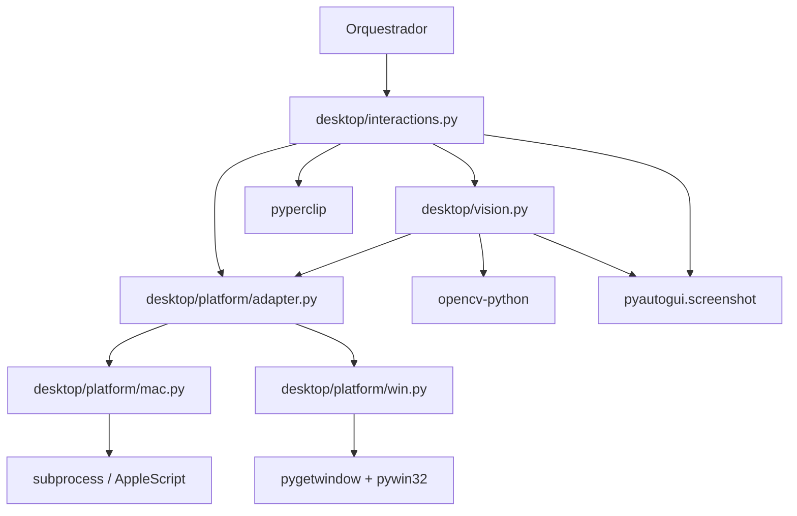

# M1 — Camada Desktop: Design

**Spec**: `.specs/features/m1-desktop-layer/spec.md`
**Status**: Draft

---

## Architecture Overview

Três camadas independentes com dependências em sentido único: adaptadores de plataforma ← ancoragem visual ← interações primitivas. O orquestrador só enxerga as primitivas; plataforma e visão ficam encapsuladas.



---

## Code Reuse Analysis

### Componentes existentes a aproveitar

| Componente | Localização | Como usar |
|---|---|---|
| `platform_info` | `src/platform_info/__init__.py` | Verificar padrão de módulo isolado por plataforma; reusar estrutura |
| `Settings` (pydantic-settings) | `src/config/settings.py` | Padrão de configuração tipada a seguir |
| Logger estruturado | `src/logger/setup.py` | `get_logger()` para logging dentro do módulo desktop |
| `screenshot_hook` | `src/logger/screenshot_hook.py` | Reusar a lógica de salvar screenshot em `logs/errors/` |
| Padrão de exceções customizadas | M0 (implícito) | Criar exceções em `desktop/exceptions.py` seguindo mesmo padrão |

### Pontos de integração

| Sistema | Método de integração |
|---|---|
| Logger | `from logger import get_logger` — mesmo logger estruturado do M0 |
| Config | `Settings` fornece `routine` name para nomear screenshots de erro |
| `logs/errors/` | Diretório já criado pelo M0; `vision.py` salva screenshots lá |

---

## Estrutura de arquivos

```
src/desktop/
├── __init__.py                  # exports públicos: get_platform_adapter, wait_for_template, ...
├── exceptions.py                # PlatformError, TemplateNotFoundError, InteractionError, UnsupportedPlatformError
├── platform/
│   ├── __init__.py
│   ├── adapter.py               # PlatformAdapter (Protocol/ABC) + get_platform_adapter() factory
│   ├── mac.py                   # MacAdapter
│   └── win.py                   # WindowsAdapter
├── vision.py                    # wait_for_template()
└── interactions.py              # click_at_template(), type_text(), clear_field(), extract_via_clipboard()

tests/desktop/
├── __init__.py
├── test_platform_adapters.py    # testes unitários MacAdapter, WindowsAdapter, factory
├── test_vision.py               # testes unitários wait_for_template com mocks
└── test_interactions.py         # testes unitários das primitivas com mocks
```

---

## Components

### `desktop/exceptions.py`

- **Purpose**: Exceções customizadas do módulo desktop, sem dependências internas.
- **Location**: `src/desktop/exceptions.py`
- **Interfaces**:
  - `class PlatformError(RuntimeError)` — erro em operação de plataforma (launch, focus)
  - `class TemplateNotFoundError(RuntimeError)` — timeout em wait_for_template; `.template_path: str`, `.screenshot_path: str`
  - `class InteractionError(RuntimeError)` — falha em primitiva de UI; `.action: str`, `.template_path: str | None`
  - `class UnsupportedPlatformError(RuntimeError)` — plataforma desconhecida (Linux, etc.)
- **Dependencies**: Nenhuma
- **Reuses**: Nada (novo)

---

### `desktop/platform/adapter.py`

- **Purpose**: Define o contrato `PlatformAdapter` via `typing.Protocol` e a factory `get_platform_adapter()`.
- **Location**: `src/desktop/platform/adapter.py`
- **Interfaces**:
  ```python
  class PlatformAdapter(Protocol):
      def launch_app(self, app_name: str) -> None: ...
      def focus_window(self, app_name: str) -> None: ...
      def modifier_key(self) -> str: ...  # "command" | "ctrl"
      def clipboard_copy(self) -> None: ...
      def clipboard_paste(self) -> None: ...

  def get_platform_adapter() -> PlatformAdapter: ...
  ```
- **Dependencies**: `sys`, `desktop/exceptions.py`
- **Reuses**: Padrão do `platform_info/__init__.py` para inspeção de `sys.platform`

---

### `desktop/platform/mac.py`

- **Purpose**: Implementa `PlatformAdapter` para macOS via AppleScript + subprocess.
- **Location**: `src/desktop/platform/mac.py`
- **Interfaces**: Implementa todos os métodos de `PlatformAdapter`
- **Detalhes de implementação**:
  - `launch_app`: `subprocess.run(["open", "-a", app_name], check=True)`
  - `focus_window`: AppleScript via `subprocess.run(["osascript", "-e", f'tell application "{app_name}" to activate'])`
  - `modifier_key`: retorna `"command"`
  - `clipboard_copy/paste`: `pyautogui.hotkey("command", "c")` / `pyautogui.hotkey("command", "v")`
  - Erros de subprocess → lança `PlatformError`
- **Dependencies**: `subprocess`, `pyautogui`, `desktop/exceptions.py`
- **Reuses**: Nada

---

### `desktop/platform/win.py`

- **Purpose**: Implementa `PlatformAdapter` para Windows via `pygetwindow` + `pywin32`.
- **Location**: `src/desktop/platform/win.py`
- **Interfaces**: Implementa todos os métodos de `PlatformAdapter`
- **Detalhes de implementação**:
  - `launch_app`: `subprocess.Popen([app_name])` (ou path resolvido via PATH)
  - `focus_window`: `pygetwindow.getWindowsWithTitle(app_name)[0].activate()`
  - `modifier_key`: retorna `"ctrl"`
  - `clipboard_copy/paste`: `pyautogui.hotkey("ctrl", "c")` / `pyautogui.hotkey("ctrl", "v")`
  - Janela não encontrada → lança `PlatformError`
- **Dependencies**: `pygetwindow`, `pyautogui`, `subprocess`, `desktop/exceptions.py`
- **Reuses**: Nada

---

### `desktop/vision.py`

- **Purpose**: Localiza elementos na tela via template matching com polling; lança exceção em timeout.
- **Location**: `src/desktop/vision.py`
- **Interfaces**:
  ```python
  def wait_for_template(
      path: str | Path,
      timeout: float = 15.0,
      threshold: float = 0.8,
      poll_interval: float = 0.5,
  ) -> tuple[int, int]:
      """Retorna (x, y) do centro do match. Lança TemplateNotFoundError em timeout."""
  ```
- **Detalhes de implementação**:
  1. Resolve path: testa `assets/templates/{sys.platform}/{basename}` primeiro, depois `assets/templates/{basename}`
  2. Loop com `time.monotonic()` para respeitar timeout sem `time.sleep` longo
  3. `pyautogui.screenshot()` → `numpy array` → `cv2.matchTemplate(TM_CCOEFF_NORMED)`
  4. Se score > threshold → retorna centro do bounding box
  5. Senão → `time.sleep(poll_interval)` e repete
  6. Em timeout → captura screenshot final, salva em `logs/errors/<timestamp>_<routine>.png`, lança `TemplateNotFoundError`
- **Dependencies**: `cv2`, `numpy`, `pyautogui`, `pathlib`, `time`, `logger`, `desktop/exceptions.py`
- **Reuses**: `screenshot_hook.py` como referência para path de logs/errors; `Settings.routine` para nome do arquivo

---

### `desktop/interactions.py`

- **Purpose**: Primitivas de UI (click, type, clear, extract) sobre posições obtidas via template matching.
- **Location**: `src/desktop/interactions.py`
- **Interfaces**:
  ```python
  def click_at_template(path: str | Path, adapter: PlatformAdapter | None = None) -> None: ...
  def type_text(text: str) -> None: ...
  def clear_field(adapter: PlatformAdapter) -> None: ...
  def extract_via_clipboard(adapter: PlatformAdapter) -> str: ...
  ```
- **Detalhes de implementação**:
  - `click_at_template`: chama `wait_for_template(path)` → `pyautogui.click(x, y)`
  - `type_text`: no-op se `text == ""`; senão `pyautogui.write(text, interval=0.05)`
  - `clear_field`: `pyautogui.hotkey(adapter.modifier_key(), "a")` → `pyautogui.press("delete")`
  - `extract_via_clipboard`: `pyautogui.hotkey(adapter.modifier_key(), "a")` → `adapter.clipboard_copy()` → `pyperclip.paste()`
  - Todas envolvidas em `try/except Exception as e: raise InteractionError(...) from e`
- **Dependencies**: `pyautogui`, `pyperclip`, `desktop/vision.py`, `desktop/platform/adapter.py`, `desktop/exceptions.py`
- **Reuses**: `wait_for_template` de `vision.py`

---

## Data Models

### `TemplateNotFoundError`

```python
class TemplateNotFoundError(RuntimeError):
    template_path: str
    screenshot_path: str   # caminho do screenshot salvo em logs/errors/
    elapsed: float         # tempo decorrido até o timeout
```

### `InteractionError`

```python
class InteractionError(RuntimeError):
    action: str             # "click_at_template" | "type_text" | etc.
    template_path: str | None
```

---

## Error Handling Strategy

| Cenário de erro | Tratamento | Impacto para o orquestrador |
|---|---|---|
| `launch_app` falha (app não instalado) | `PlatformError` com mensagem descritiva | Orquestrador captura, salva screenshot, encerra rotina |
| Template não encontrado em 15s | Screenshot → `TemplateNotFoundError` | Orquestrador captura, já tem screenshot |
| Arquivo de template inexistente | `FileNotFoundError` imediato | Falha rápida; sem screenshot (bug de configuração) |
| `pyautogui` falha durante click/type | `InteractionError` com contexto | Orquestrador captura, salva screenshot |
| Plataforma desconhecida (Linux) | `UnsupportedPlatformError` no boot | Falha rápida antes de qualquer ação de UI |

---

## Tech Decisions

| Decisão | Escolha | Rationale |
|---|---|---|
| `Protocol` vs `ABC` para adapter | `typing.Protocol` | Structural typing — sem herança obrigatória; mais Pythônico para adapters externos |
| Polling vs `asyncio` | Loop síncrono com `time.monotonic` + `time.sleep(0.5)` | Orquestrador é síncrono; asyncio seria overhead sem benefício |
| Template path resolution | Fallback `{platform}/` → raiz | Decisão GA-01 confirmada pelo usuário |
| `pyperclip` vs `pyautogui` clipboard | `pyperclip.paste()` para leitura | `pyautogui` não expõe leitura de clipboard; `pyperclip` é cross-platform e está na árvore de dependências transitivas do pyautogui |
| `pyautogui.write` vs `pyautogui.typewrite` | `pyautogui.write` | Mesmo comportamento; `write` é o alias moderno |
